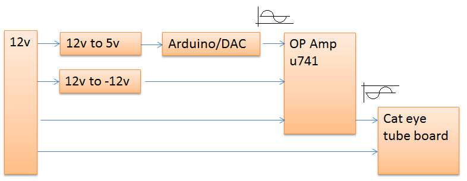
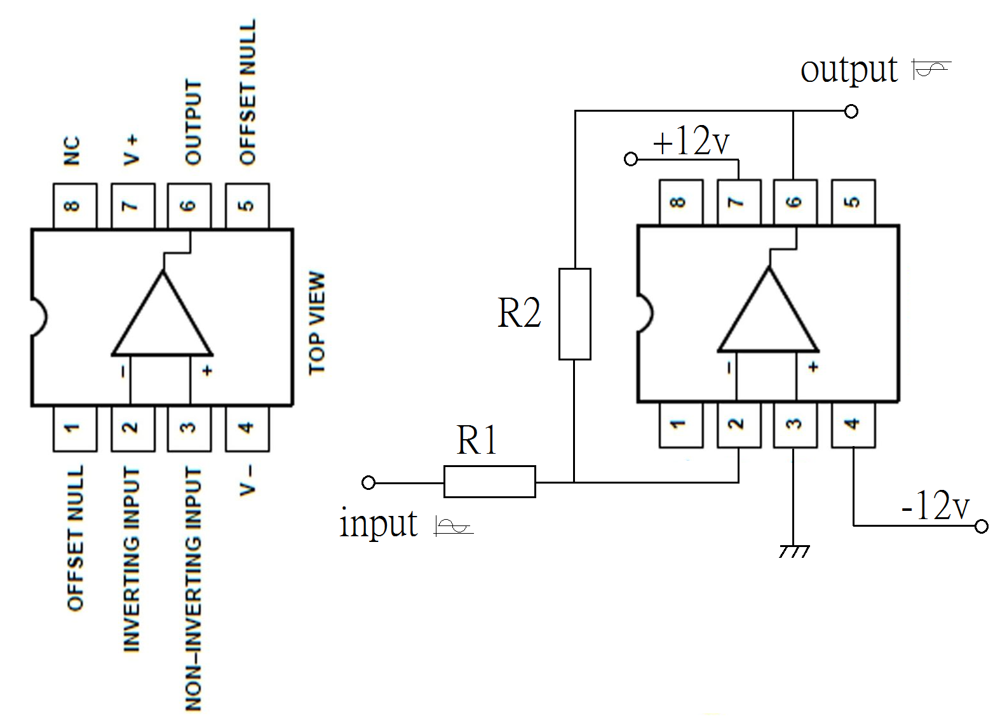
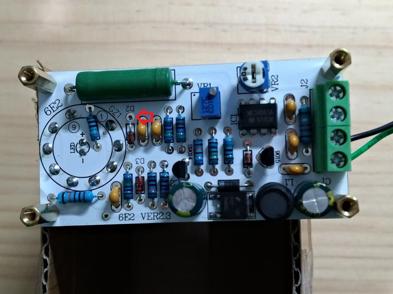
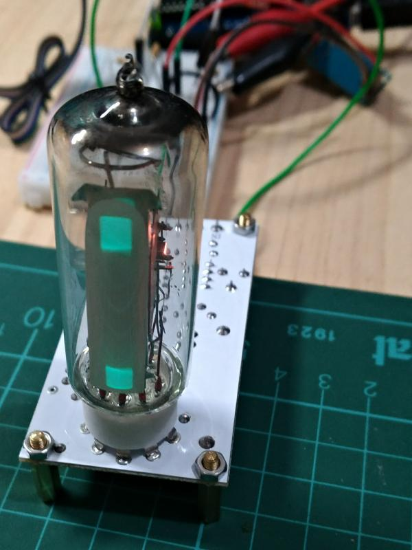
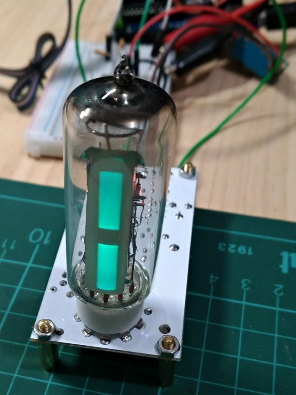
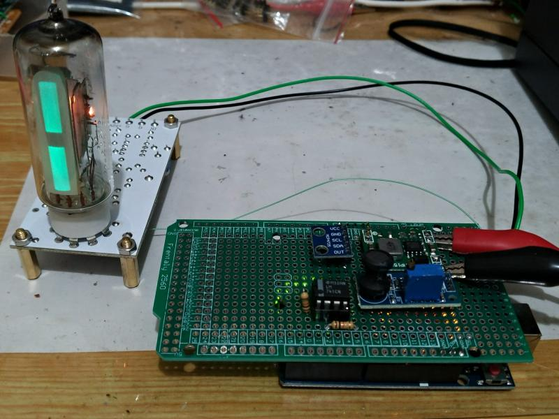

# 00 cat eye tube
## im progress
  
 
uA741 with R1=R2=10K ohm, as inverting amplifier.  
 
 
 
 
Remove D2 and input signal as arrow.  
 
Phototype1, check range of 0 ~ -5v.  
 
 
Phototype1, check range of 0 ~ -5v.  
 
 
Phototype2  
 

