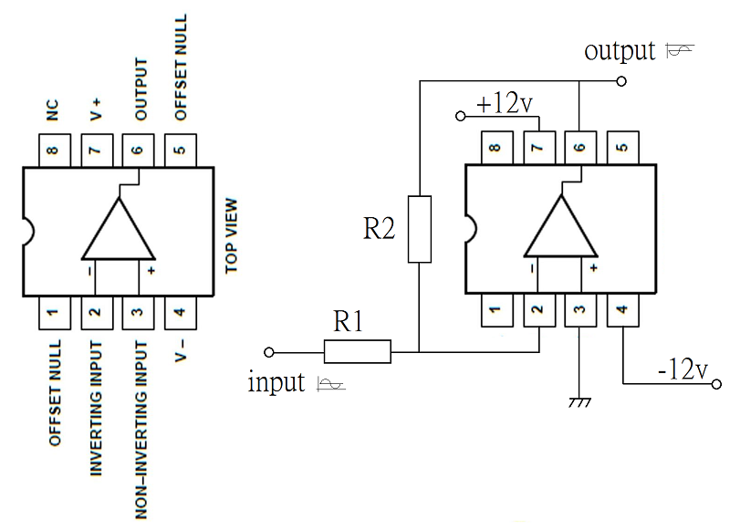
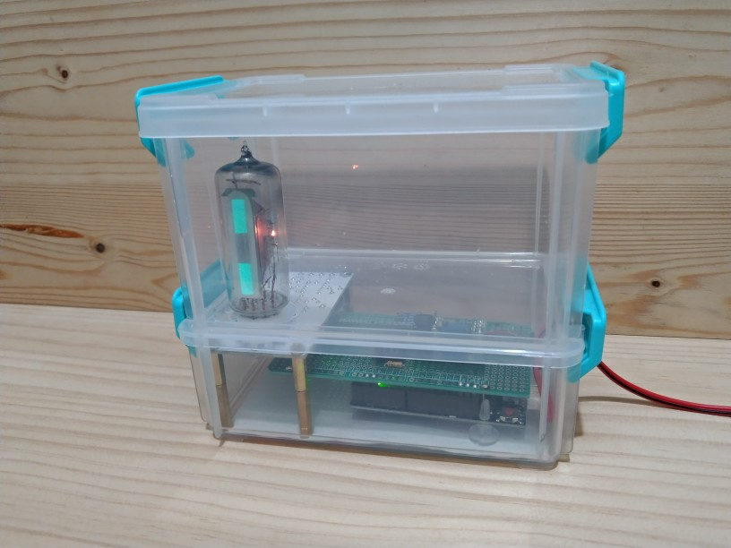

# 00 cat eye tube
## im progress
  
 
uA741 with R1=R2=10K ohm, as inverting amplifier.  
 
 
 
 
Remove D2 and input signal as arrow.  
 
Phototype1, check range of 0 ~ -5v.  
 
 
Phototype1, check range of 0 ~ -5v.  
 
 
Phototype2  
 
 
Final version
 
 
[[Video_1]](https://youtu.be/gk1ZZpDRiPU) 
 
確保已安裝 Adafruit 的 MCP4725 庫，可以通過 Arduino IDE 的庫管理器來安裝。 
